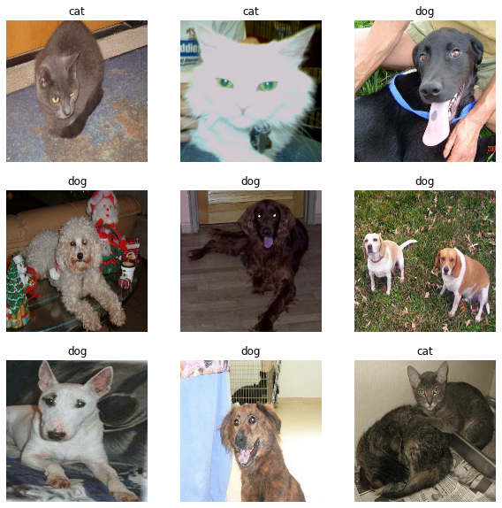
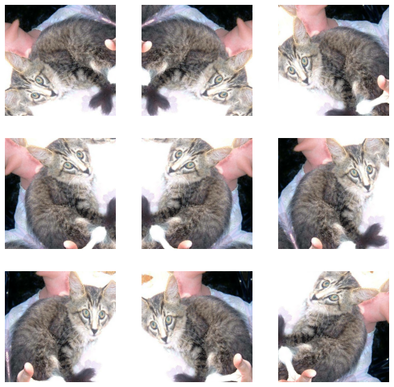
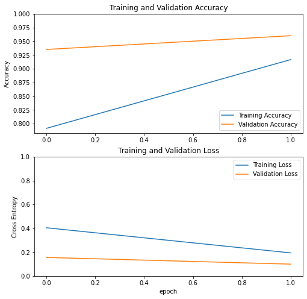
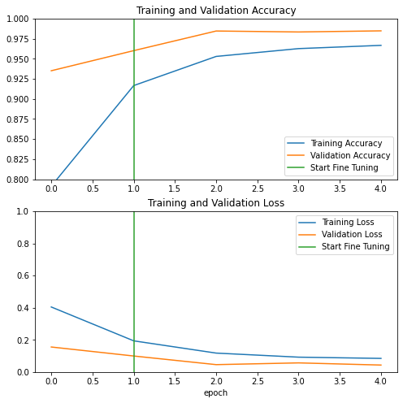

```python
!pip install -q pandas
!pip install -q keras
```

    WARNING: You are using pip version 20.2.4; however, version 21.0.1 is available.
    You should consider upgrading via the '/usr/bin/python3 -m pip install --upgrade pip' command.
    WARNING: You are using pip version 20.2.4; however, version 21.0.1 is available.
    You should consider upgrading via the '/usr/bin/python3 -m pip install --upgrade pip' command.


```python
import matplotlib.pyplot as plt
import numpy as np
import os
import tensorflow as tf
import pandas as pd

from tensorflow.keras.preprocessing import image_dataset_from_directory
```


```python
train_dir = 'data/train/'
test_dir = 'data/test1/'
```


```python
BATCH_SIZE = 32
IMG_SIZE = (160, 160)

train_dataset = image_dataset_from_directory(train_dir,
                                             shuffle=True,
                                             batch_size=BATCH_SIZE,
                                             image_size=IMG_SIZE)
```

    Found 25000 files belonging to 2 classes.


```python
class_names = train_dataset.class_names

plt.figure(figsize=(10, 10))
for images, labels in train_dataset.take(1):
  for i in range(9):
    ax = plt.subplot(3, 3, i + 1)
    plt.imshow(images[i].numpy().astype("uint8"))
    plt.title(class_names[labels[i]])
    plt.axis("off")
```


    

    


```python
train_batches = tf.data.experimental.cardinality(train_dataset)
test_dataset = train_dataset.take(train_batches // 5)
train_dataset = train_dataset.skip(train_batches // 5)
```


```python
print('Number of validation batches: %d' % tf.data.experimental.cardinality(train_dataset))
print('Number of test batches: %d' % tf.data.experimental.cardinality(test_dataset))
```

    Number of validation batches: 626
    Number of test batches: 156


```python
AUTOTUNE = tf.data.AUTOTUNE

train_dataset = train_dataset.prefetch(buffer_size=AUTOTUNE)
test_dataset = test_dataset.prefetch(buffer_size=AUTOTUNE)
```


```python
data_augmentation = tf.keras.Sequential([
  tf.keras.layers.experimental.preprocessing.RandomFlip('horizontal'),
  tf.keras.layers.experimental.preprocessing.RandomRotation(0.2),
])
```


```python
for image, _ in train_dataset.take(1):
  plt.figure(figsize=(10, 10))
  first_image = image[0]
  for i in range(9):
    ax = plt.subplot(3, 3, i + 1)
    augmented_image = data_augmentation(tf.expand_dims(first_image, 0))
    plt.imshow(augmented_image[0] / 255)
    plt.axis('off')
```


    

    


```python
preprocess_input = tf.keras.applications.mobilenet_v2.preprocess_input
```


```python
# Create the base model from the pre-trained model MobileNet V2
IMG_SHAPE = IMG_SIZE + (3,)
base_model = tf.keras.applications.MobileNetV2(input_shape=IMG_SHAPE,
                                               include_top=False,
                                               weights='imagenet')
```


```python
image_batch, label_batch = next(iter(train_dataset))
feature_batch = base_model(image_batch)
print(feature_batch.shape)
```

    (32, 5, 5, 1280)


```python
base_model.trainable = False
```


```python
base_model.summary()
```

    Model: "mobilenetv2_1.00_160"
    __________________________________________________________________________________________________
    Layer (type)                    Output Shape         Param #     Connected to                     
    ==================================================================================================
    input_1 (InputLayer)            [(None, 160, 160, 3) 0                                            
    __________________________________________________________________________________________________
    Conv1 (Conv2D)                  (None, 80, 80, 32)   864         input_1[0][0]                    
    __________________________________________________________________________________________________
    bn_Conv1 (BatchNormalization)   (None, 80, 80, 32)   128         Conv1[0][0]                      
    __________________________________________________________________________________________________
    Conv1_relu (ReLU)               (None, 80, 80, 32)   0           bn_Conv1[0][0]                   
    __________________________________________________________________________________________________
    expanded_conv_depthwise (Depthw (None, 80, 80, 32)   288         Conv1_relu[0][0]                 
    __________________________________________________________________________________________________
    expanded_conv_depthwise_BN (Bat (None, 80, 80, 32)   128         expanded_conv_depthwise[0][0]    
    __________________________________________________________________________________________________
    expanded_conv_depthwise_relu (R (None, 80, 80, 32)   0           expanded_conv_depthwise_BN[0][0] 
    __________________________________________________________________________________________________
    expanded_conv_project (Conv2D)  (None, 80, 80, 16)   512         expanded_conv_depthwise_relu[0][0
    __________________________________________________________________________________________________
    expanded_conv_project_BN (Batch (None, 80, 80, 16)   64          expanded_conv_project[0][0]      
    __________________________________________________________________________________________________
    block_1_expand (Conv2D)         (None, 80, 80, 96)   1536        expanded_conv_project_BN[0][0]   
    __________________________________________________________________________________________________
    block_1_expand_BN (BatchNormali (None, 80, 80, 96)   384         block_1_expand[0][0]             
    __________________________________________________________________________________________________
    block_1_expand_relu (ReLU)      (None, 80, 80, 96)   0           block_1_expand_BN[0][0]          
    __________________________________________________________________________________________________
    block_1_pad (ZeroPadding2D)     (None, 81, 81, 96)   0           block_1_expand_relu[0][0]        
    __________________________________________________________________________________________________
    block_1_depthwise (DepthwiseCon (None, 40, 40, 96)   864         block_1_pad[0][0]                
    __________________________________________________________________________________________________
    block_1_depthwise_BN (BatchNorm (None, 40, 40, 96)   384         block_1_depthwise[0][0]          
    __________________________________________________________________________________________________
    block_1_depthwise_relu (ReLU)   (None, 40, 40, 96)   0           block_1_depthwise_BN[0][0]       
    __________________________________________________________________________________________________
    block_1_project (Conv2D)        (None, 40, 40, 24)   2304        block_1_depthwise_relu[0][0]     
    __________________________________________________________________________________________________
    block_1_project_BN (BatchNormal (None, 40, 40, 24)   96          block_1_project[0][0]            
    __________________________________________________________________________________________________
    block_2_expand (Conv2D)         (None, 40, 40, 144)  3456        block_1_project_BN[0][0]         
    __________________________________________________________________________________________________
    block_2_expand_BN (BatchNormali (None, 40, 40, 144)  576         block_2_expand[0][0]             
    __________________________________________________________________________________________________
    block_2_expand_relu (ReLU)      (None, 40, 40, 144)  0           block_2_expand_BN[0][0]          
    __________________________________________________________________________________________________
    block_2_depthwise (DepthwiseCon (None, 40, 40, 144)  1296        block_2_expand_relu[0][0]        
    __________________________________________________________________________________________________
    block_2_depthwise_BN (BatchNorm (None, 40, 40, 144)  576         block_2_depthwise[0][0]          
    __________________________________________________________________________________________________
    block_2_depthwise_relu (ReLU)   (None, 40, 40, 144)  0           block_2_depthwise_BN[0][0]       
    __________________________________________________________________________________________________
    block_2_project (Conv2D)        (None, 40, 40, 24)   3456        block_2_depthwise_relu[0][0]     
    __________________________________________________________________________________________________
    block_2_project_BN (BatchNormal (None, 40, 40, 24)   96          block_2_project[0][0]            
    __________________________________________________________________________________________________
    block_2_add (Add)               (None, 40, 40, 24)   0           block_1_project_BN[0][0]         
                                                                     block_2_project_BN[0][0]         
    __________________________________________________________________________________________________
    block_3_expand (Conv2D)         (None, 40, 40, 144)  3456        block_2_add[0][0]                
    __________________________________________________________________________________________________
    block_3_expand_BN (BatchNormali (None, 40, 40, 144)  576         block_3_expand[0][0]             
    __________________________________________________________________________________________________
    block_3_expand_relu (ReLU)      (None, 40, 40, 144)  0           block_3_expand_BN[0][0]          
    __________________________________________________________________________________________________
    block_3_pad (ZeroPadding2D)     (None, 41, 41, 144)  0           block_3_expand_relu[0][0]        
    __________________________________________________________________________________________________
    block_3_depthwise (DepthwiseCon (None, 20, 20, 144)  1296        block_3_pad[0][0]                
    __________________________________________________________________________________________________
    block_3_depthwise_BN (BatchNorm (None, 20, 20, 144)  576         block_3_depthwise[0][0]          
    __________________________________________________________________________________________________
    block_3_depthwise_relu (ReLU)   (None, 20, 20, 144)  0           block_3_depthwise_BN[0][0]       
    __________________________________________________________________________________________________
    block_3_project (Conv2D)        (None, 20, 20, 32)   4608        block_3_depthwise_relu[0][0]     
    __________________________________________________________________________________________________
    block_3_project_BN (BatchNormal (None, 20, 20, 32)   128         block_3_project[0][0]            
    __________________________________________________________________________________________________
    block_4_expand (Conv2D)         (None, 20, 20, 192)  6144        block_3_project_BN[0][0]         
    __________________________________________________________________________________________________
    block_4_expand_BN (BatchNormali (None, 20, 20, 192)  768         block_4_expand[0][0]             
    __________________________________________________________________________________________________
    block_4_expand_relu (ReLU)      (None, 20, 20, 192)  0           block_4_expand_BN[0][0]          
    __________________________________________________________________________________________________
    block_4_depthwise (DepthwiseCon (None, 20, 20, 192)  1728        block_4_expand_relu[0][0]        
    __________________________________________________________________________________________________
    block_4_depthwise_BN (BatchNorm (None, 20, 20, 192)  768         block_4_depthwise[0][0]          
    __________________________________________________________________________________________________
    block_4_depthwise_relu (ReLU)   (None, 20, 20, 192)  0           block_4_depthwise_BN[0][0]       
    __________________________________________________________________________________________________
    block_4_project (Conv2D)        (None, 20, 20, 32)   6144        block_4_depthwise_relu[0][0]     
    __________________________________________________________________________________________________
    block_4_project_BN (BatchNormal (None, 20, 20, 32)   128         block_4_project[0][0]            
    __________________________________________________________________________________________________
    block_4_add (Add)               (None, 20, 20, 32)   0           block_3_project_BN[0][0]         
                                                                     block_4_project_BN[0][0]         
    __________________________________________________________________________________________________
    block_5_expand (Conv2D)         (None, 20, 20, 192)  6144        block_4_add[0][0]                
    __________________________________________________________________________________________________
    block_5_expand_BN (BatchNormali (None, 20, 20, 192)  768         block_5_expand[0][0]             
    __________________________________________________________________________________________________
    block_5_expand_relu (ReLU)      (None, 20, 20, 192)  0           block_5_expand_BN[0][0]          
    __________________________________________________________________________________________________
    block_5_depthwise (DepthwiseCon (None, 20, 20, 192)  1728        block_5_expand_relu[0][0]        
    __________________________________________________________________________________________________
    block_5_depthwise_BN (BatchNorm (None, 20, 20, 192)  768         block_5_depthwise[0][0]          
    __________________________________________________________________________________________________
    block_5_depthwise_relu (ReLU)   (None, 20, 20, 192)  0           block_5_depthwise_BN[0][0]       
    __________________________________________________________________________________________________
    block_5_project (Conv2D)        (None, 20, 20, 32)   6144        block_5_depthwise_relu[0][0]     
    __________________________________________________________________________________________________
    block_5_project_BN (BatchNormal (None, 20, 20, 32)   128         block_5_project[0][0]            
    __________________________________________________________________________________________________
    block_5_add (Add)               (None, 20, 20, 32)   0           block_4_add[0][0]                
                                                                     block_5_project_BN[0][0]         
    __________________________________________________________________________________________________
    block_6_expand (Conv2D)         (None, 20, 20, 192)  6144        block_5_add[0][0]                
    __________________________________________________________________________________________________
    block_6_expand_BN (BatchNormali (None, 20, 20, 192)  768         block_6_expand[0][0]             
    __________________________________________________________________________________________________
    block_6_expand_relu (ReLU)      (None, 20, 20, 192)  0           block_6_expand_BN[0][0]          
    __________________________________________________________________________________________________
    block_6_pad (ZeroPadding2D)     (None, 21, 21, 192)  0           block_6_expand_relu[0][0]        
    __________________________________________________________________________________________________
    block_6_depthwise (DepthwiseCon (None, 10, 10, 192)  1728        block_6_pad[0][0]                
    __________________________________________________________________________________________________
    block_6_depthwise_BN (BatchNorm (None, 10, 10, 192)  768         block_6_depthwise[0][0]          
    __________________________________________________________________________________________________
    block_6_depthwise_relu (ReLU)   (None, 10, 10, 192)  0           block_6_depthwise_BN[0][0]       
    __________________________________________________________________________________________________
    block_6_project (Conv2D)        (None, 10, 10, 64)   12288       block_6_depthwise_relu[0][0]     
    __________________________________________________________________________________________________
    block_6_project_BN (BatchNormal (None, 10, 10, 64)   256         block_6_project[0][0]            
    __________________________________________________________________________________________________
    block_7_expand (Conv2D)         (None, 10, 10, 384)  24576       block_6_project_BN[0][0]         
    __________________________________________________________________________________________________
    block_7_expand_BN (BatchNormali (None, 10, 10, 384)  1536        block_7_expand[0][0]             
    __________________________________________________________________________________________________
    block_7_expand_relu (ReLU)      (None, 10, 10, 384)  0           block_7_expand_BN[0][0]          
    __________________________________________________________________________________________________
    block_7_depthwise (DepthwiseCon (None, 10, 10, 384)  3456        block_7_expand_relu[0][0]        
    __________________________________________________________________________________________________
    block_7_depthwise_BN (BatchNorm (None, 10, 10, 384)  1536        block_7_depthwise[0][0]          
    __________________________________________________________________________________________________
    block_7_depthwise_relu (ReLU)   (None, 10, 10, 384)  0           block_7_depthwise_BN[0][0]       
    __________________________________________________________________________________________________
    block_7_project (Conv2D)        (None, 10, 10, 64)   24576       block_7_depthwise_relu[0][0]     
    __________________________________________________________________________________________________
    block_7_project_BN (BatchNormal (None, 10, 10, 64)   256         block_7_project[0][0]            
    __________________________________________________________________________________________________
    block_7_add (Add)               (None, 10, 10, 64)   0           block_6_project_BN[0][0]         
                                                                     block_7_project_BN[0][0]         
    __________________________________________________________________________________________________
    block_8_expand (Conv2D)         (None, 10, 10, 384)  24576       block_7_add[0][0]                
    __________________________________________________________________________________________________
    block_8_expand_BN (BatchNormali (None, 10, 10, 384)  1536        block_8_expand[0][0]             
    __________________________________________________________________________________________________
    block_8_expand_relu (ReLU)      (None, 10, 10, 384)  0           block_8_expand_BN[0][0]          
    __________________________________________________________________________________________________
    block_8_depthwise (DepthwiseCon (None, 10, 10, 384)  3456        block_8_expand_relu[0][0]        
    __________________________________________________________________________________________________
    block_8_depthwise_BN (BatchNorm (None, 10, 10, 384)  1536        block_8_depthwise[0][0]          
    __________________________________________________________________________________________________
    block_8_depthwise_relu (ReLU)   (None, 10, 10, 384)  0           block_8_depthwise_BN[0][0]       
    __________________________________________________________________________________________________
    block_8_project (Conv2D)        (None, 10, 10, 64)   24576       block_8_depthwise_relu[0][0]     
    __________________________________________________________________________________________________
    block_8_project_BN (BatchNormal (None, 10, 10, 64)   256         block_8_project[0][0]            
    __________________________________________________________________________________________________
    block_8_add (Add)               (None, 10, 10, 64)   0           block_7_add[0][0]                
                                                                     block_8_project_BN[0][0]         
    __________________________________________________________________________________________________
    block_9_expand (Conv2D)         (None, 10, 10, 384)  24576       block_8_add[0][0]                
    __________________________________________________________________________________________________
    block_9_expand_BN (BatchNormali (None, 10, 10, 384)  1536        block_9_expand[0][0]             
    __________________________________________________________________________________________________
    block_9_expand_relu (ReLU)      (None, 10, 10, 384)  0           block_9_expand_BN[0][0]          
    __________________________________________________________________________________________________
    block_9_depthwise (DepthwiseCon (None, 10, 10, 384)  3456        block_9_expand_relu[0][0]        
    __________________________________________________________________________________________________
    block_9_depthwise_BN (BatchNorm (None, 10, 10, 384)  1536        block_9_depthwise[0][0]          
    __________________________________________________________________________________________________
    block_9_depthwise_relu (ReLU)   (None, 10, 10, 384)  0           block_9_depthwise_BN[0][0]       
    __________________________________________________________________________________________________
    block_9_project (Conv2D)        (None, 10, 10, 64)   24576       block_9_depthwise_relu[0][0]     
    __________________________________________________________________________________________________
    block_9_project_BN (BatchNormal (None, 10, 10, 64)   256         block_9_project[0][0]            
    __________________________________________________________________________________________________
    block_9_add (Add)               (None, 10, 10, 64)   0           block_8_add[0][0]                
                                                                     block_9_project_BN[0][0]         
    __________________________________________________________________________________________________
    block_10_expand (Conv2D)        (None, 10, 10, 384)  24576       block_9_add[0][0]                
    __________________________________________________________________________________________________
    block_10_expand_BN (BatchNormal (None, 10, 10, 384)  1536        block_10_expand[0][0]            
    __________________________________________________________________________________________________
    block_10_expand_relu (ReLU)     (None, 10, 10, 384)  0           block_10_expand_BN[0][0]         
    __________________________________________________________________________________________________
    block_10_depthwise (DepthwiseCo (None, 10, 10, 384)  3456        block_10_expand_relu[0][0]       
    __________________________________________________________________________________________________
    block_10_depthwise_BN (BatchNor (None, 10, 10, 384)  1536        block_10_depthwise[0][0]         
    __________________________________________________________________________________________________
    block_10_depthwise_relu (ReLU)  (None, 10, 10, 384)  0           block_10_depthwise_BN[0][0]      
    __________________________________________________________________________________________________
    block_10_project (Conv2D)       (None, 10, 10, 96)   36864       block_10_depthwise_relu[0][0]    
    __________________________________________________________________________________________________
    block_10_project_BN (BatchNorma (None, 10, 10, 96)   384         block_10_project[0][0]           
    __________________________________________________________________________________________________
    block_11_expand (Conv2D)        (None, 10, 10, 576)  55296       block_10_project_BN[0][0]        
    __________________________________________________________________________________________________
    block_11_expand_BN (BatchNormal (None, 10, 10, 576)  2304        block_11_expand[0][0]            
    __________________________________________________________________________________________________
    block_11_expand_relu (ReLU)     (None, 10, 10, 576)  0           block_11_expand_BN[0][0]         
    __________________________________________________________________________________________________
    block_11_depthwise (DepthwiseCo (None, 10, 10, 576)  5184        block_11_expand_relu[0][0]       
    __________________________________________________________________________________________________
    block_11_depthwise_BN (BatchNor (None, 10, 10, 576)  2304        block_11_depthwise[0][0]         
    __________________________________________________________________________________________________
    block_11_depthwise_relu (ReLU)  (None, 10, 10, 576)  0           block_11_depthwise_BN[0][0]      
    __________________________________________________________________________________________________
    block_11_project (Conv2D)       (None, 10, 10, 96)   55296       block_11_depthwise_relu[0][0]    
    __________________________________________________________________________________________________
    block_11_project_BN (BatchNorma (None, 10, 10, 96)   384         block_11_project[0][0]           
    __________________________________________________________________________________________________
    block_11_add (Add)              (None, 10, 10, 96)   0           block_10_project_BN[0][0]        
                                                                     block_11_project_BN[0][0]        
    __________________________________________________________________________________________________
    block_12_expand (Conv2D)        (None, 10, 10, 576)  55296       block_11_add[0][0]               
    __________________________________________________________________________________________________
    block_12_expand_BN (BatchNormal (None, 10, 10, 576)  2304        block_12_expand[0][0]            
    __________________________________________________________________________________________________
    block_12_expand_relu (ReLU)     (None, 10, 10, 576)  0           block_12_expand_BN[0][0]         
    __________________________________________________________________________________________________
    block_12_depthwise (DepthwiseCo (None, 10, 10, 576)  5184        block_12_expand_relu[0][0]       
    __________________________________________________________________________________________________
    block_12_depthwise_BN (BatchNor (None, 10, 10, 576)  2304        block_12_depthwise[0][0]         
    __________________________________________________________________________________________________
    block_12_depthwise_relu (ReLU)  (None, 10, 10, 576)  0           block_12_depthwise_BN[0][0]      
    __________________________________________________________________________________________________
    block_12_project (Conv2D)       (None, 10, 10, 96)   55296       block_12_depthwise_relu[0][0]    
    __________________________________________________________________________________________________
    block_12_project_BN (BatchNorma (None, 10, 10, 96)   384         block_12_project[0][0]           
    __________________________________________________________________________________________________
    block_12_add (Add)              (None, 10, 10, 96)   0           block_11_add[0][0]               
                                                                     block_12_project_BN[0][0]        
    __________________________________________________________________________________________________
    block_13_expand (Conv2D)        (None, 10, 10, 576)  55296       block_12_add[0][0]               
    __________________________________________________________________________________________________
    block_13_expand_BN (BatchNormal (None, 10, 10, 576)  2304        block_13_expand[0][0]            
    __________________________________________________________________________________________________
    block_13_expand_relu (ReLU)     (None, 10, 10, 576)  0           block_13_expand_BN[0][0]         
    __________________________________________________________________________________________________
    block_13_pad (ZeroPadding2D)    (None, 11, 11, 576)  0           block_13_expand_relu[0][0]       
    __________________________________________________________________________________________________
    block_13_depthwise (DepthwiseCo (None, 5, 5, 576)    5184        block_13_pad[0][0]               
    __________________________________________________________________________________________________
    block_13_depthwise_BN (BatchNor (None, 5, 5, 576)    2304        block_13_depthwise[0][0]         
    __________________________________________________________________________________________________
    block_13_depthwise_relu (ReLU)  (None, 5, 5, 576)    0           block_13_depthwise_BN[0][0]      
    __________________________________________________________________________________________________
    block_13_project (Conv2D)       (None, 5, 5, 160)    92160       block_13_depthwise_relu[0][0]    
    __________________________________________________________________________________________________
    block_13_project_BN (BatchNorma (None, 5, 5, 160)    640         block_13_project[0][0]           
    __________________________________________________________________________________________________
    block_14_expand (Conv2D)        (None, 5, 5, 960)    153600      block_13_project_BN[0][0]        
    __________________________________________________________________________________________________
    block_14_expand_BN (BatchNormal (None, 5, 5, 960)    3840        block_14_expand[0][0]            
    __________________________________________________________________________________________________
    block_14_expand_relu (ReLU)     (None, 5, 5, 960)    0           block_14_expand_BN[0][0]         
    __________________________________________________________________________________________________
    block_14_depthwise (DepthwiseCo (None, 5, 5, 960)    8640        block_14_expand_relu[0][0]       
    __________________________________________________________________________________________________
    block_14_depthwise_BN (BatchNor (None, 5, 5, 960)    3840        block_14_depthwise[0][0]         
    __________________________________________________________________________________________________
    block_14_depthwise_relu (ReLU)  (None, 5, 5, 960)    0           block_14_depthwise_BN[0][0]      
    __________________________________________________________________________________________________
    block_14_project (Conv2D)       (None, 5, 5, 160)    153600      block_14_depthwise_relu[0][0]    
    __________________________________________________________________________________________________
    block_14_project_BN (BatchNorma (None, 5, 5, 160)    640         block_14_project[0][0]           
    __________________________________________________________________________________________________
    block_14_add (Add)              (None, 5, 5, 160)    0           block_13_project_BN[0][0]        
                                                                     block_14_project_BN[0][0]        
    __________________________________________________________________________________________________
    block_15_expand (Conv2D)        (None, 5, 5, 960)    153600      block_14_add[0][0]               
    __________________________________________________________________________________________________
    block_15_expand_BN (BatchNormal (None, 5, 5, 960)    3840        block_15_expand[0][0]            
    __________________________________________________________________________________________________
    block_15_expand_relu (ReLU)     (None, 5, 5, 960)    0           block_15_expand_BN[0][0]         
    __________________________________________________________________________________________________
    block_15_depthwise (DepthwiseCo (None, 5, 5, 960)    8640        block_15_expand_relu[0][0]       
    __________________________________________________________________________________________________
    block_15_depthwise_BN (BatchNor (None, 5, 5, 960)    3840        block_15_depthwise[0][0]         
    __________________________________________________________________________________________________
    block_15_depthwise_relu (ReLU)  (None, 5, 5, 960)    0           block_15_depthwise_BN[0][0]      
    __________________________________________________________________________________________________
    block_15_project (Conv2D)       (None, 5, 5, 160)    153600      block_15_depthwise_relu[0][0]    
    __________________________________________________________________________________________________
    block_15_project_BN (BatchNorma (None, 5, 5, 160)    640         block_15_project[0][0]           
    __________________________________________________________________________________________________
    block_15_add (Add)              (None, 5, 5, 160)    0           block_14_add[0][0]               
                                                                     block_15_project_BN[0][0]        
    __________________________________________________________________________________________________
    block_16_expand (Conv2D)        (None, 5, 5, 960)    153600      block_15_add[0][0]               
    __________________________________________________________________________________________________
    block_16_expand_BN (BatchNormal (None, 5, 5, 960)    3840        block_16_expand[0][0]            
    __________________________________________________________________________________________________
    block_16_expand_relu (ReLU)     (None, 5, 5, 960)    0           block_16_expand_BN[0][0]         
    __________________________________________________________________________________________________
    block_16_depthwise (DepthwiseCo (None, 5, 5, 960)    8640        block_16_expand_relu[0][0]       
    __________________________________________________________________________________________________
    block_16_depthwise_BN (BatchNor (None, 5, 5, 960)    3840        block_16_depthwise[0][0]         
    __________________________________________________________________________________________________
    block_16_depthwise_relu (ReLU)  (None, 5, 5, 960)    0           block_16_depthwise_BN[0][0]      
    __________________________________________________________________________________________________
    block_16_project (Conv2D)       (None, 5, 5, 320)    307200      block_16_depthwise_relu[0][0]    
    __________________________________________________________________________________________________
    block_16_project_BN (BatchNorma (None, 5, 5, 320)    1280        block_16_project[0][0]           
    __________________________________________________________________________________________________
    Conv_1 (Conv2D)                 (None, 5, 5, 1280)   409600      block_16_project_BN[0][0]        
    __________________________________________________________________________________________________
    Conv_1_bn (BatchNormalization)  (None, 5, 5, 1280)   5120        Conv_1[0][0]                     
    __________________________________________________________________________________________________
    out_relu (ReLU)                 (None, 5, 5, 1280)   0           Conv_1_bn[0][0]                  
    ==================================================================================================
    Total params: 2,257,984
    Trainable params: 0
    Non-trainable params: 2,257,984
    __________________________________________________________________________________________________


```python
global_average_layer = tf.keras.layers.GlobalAveragePooling2D()
feature_batch_average = global_average_layer(feature_batch)
print(feature_batch_average.shape)
```

    (32, 1280)


```python
prediction_layer = tf.keras.layers.Dense(1)
prediction_batch = prediction_layer(feature_batch_average)
print(prediction_batch.shape)
```

    (32, 1)


```python
inputs = tf.keras.Input(shape=(160, 160, 3))
x = data_augmentation(inputs)
x = preprocess_input(x)
x = base_model(x, training=False)
x = global_average_layer(x)
x = tf.keras.layers.Dropout(0.2)(x)
outputs = prediction_layer(x)
model = tf.keras.Model(inputs, outputs)
```


```python
base_learning_rate = 0.0001
model.compile(optimizer=tf.keras.optimizers.Adam(lr=base_learning_rate),
              loss=tf.keras.losses.BinaryCrossentropy(from_logits=True),
              metrics=['accuracy'])
```


```python
model.summary()
```

    Model: "model"
    _________________________________________________________________
    Layer (type)                 Output Shape              Param #   
    =================================================================
    input_2 (InputLayer)         [(None, 160, 160, 3)]     0         
    _________________________________________________________________
    sequential (Sequential)      (None, 160, 160, 3)       0         
    _________________________________________________________________
    tf.math.truediv (TFOpLambda) (None, 160, 160, 3)       0         
    _________________________________________________________________
    tf.math.subtract (TFOpLambda (None, 160, 160, 3)       0         
    _________________________________________________________________
    mobilenetv2_1.00_160 (Functi (None, 5, 5, 1280)        2257984   
    _________________________________________________________________
    global_average_pooling2d (Gl (None, 1280)              0         
    _________________________________________________________________
    dropout (Dropout)            (None, 1280)              0         
    _________________________________________________________________
    dense (Dense)                (None, 1)                 1281      
    =================================================================
    Total params: 2,259,265
    Trainable params: 1,281
    Non-trainable params: 2,257,984
    _________________________________________________________________


```python
len(model.trainable_variables)
```


    2


```python
initial_epochs = 2

loss0, accuracy0 = model.evaluate(test_dataset)
```

    156/156 [==============================] - 68s 420ms/step - loss: 0.9808 - accuracy: 0.3238


```python
print("initial loss: {:.2f}".format(loss0))
print("initial accuracy: {:.2f}".format(accuracy0))
```

    initial loss: 0.98
    initial accuracy: 0.32


```python
%%time
history = model.fit(train_dataset,
                    epochs=initial_epochs,
                    validation_data=test_dataset)
```

    Epoch 1/2
    626/626 [==============================] - 357s 546ms/step - loss: 0.4046 - accuracy: 0.7914 - val_loss: 0.1554 - val_accuracy: 0.9351
    Epoch 2/2
    626/626 [==============================] - 333s 518ms/step - loss: 0.1938 - accuracy: 0.9166 - val_loss: 0.0994 - val_accuracy: 0.9601
    CPU times: user 25min 12s, sys: 5min 15s, total: 30min 27s
    Wall time: 11min 30s


```python
acc = history.history['accuracy']
val_acc = history.history['val_accuracy']

loss = history.history['loss']
val_loss = history.history['val_loss']

plt.figure(figsize=(8, 8))
plt.subplot(2, 1, 1)
plt.plot(acc, label='Training Accuracy')
plt.plot(val_acc, label='Validation Accuracy')
plt.legend(loc='lower right')
plt.ylabel('Accuracy')
plt.ylim([min(plt.ylim()),1])
plt.title('Training and Validation Accuracy')

plt.subplot(2, 1, 2)
plt.plot(loss, label='Training Loss')
plt.plot(val_loss, label='Validation Loss')
plt.legend(loc='upper right')
plt.ylabel('Cross Entropy')
plt.ylim([0,1.0])
plt.title('Training and Validation Loss')
plt.xlabel('epoch')
plt.show()
```


    

    


```python
base_model.trainable = True
```


```python
# Let's take a look to see how many layers are in the base model
print("Number of layers in the base model: ", len(base_model.layers))

# Fine-tune from this layer onwards
fine_tune_at = 100

# Freeze all the layers before the `fine_tune_at` layer
for layer in base_model.layers[:fine_tune_at]:
  layer.trainable =  False
```

    Number of layers in the base model:  154


```python
model.compile(loss=tf.keras.losses.BinaryCrossentropy(from_logits=True),
              optimizer = tf.keras.optimizers.RMSprop(lr=base_learning_rate/10),
              metrics=['accuracy'])
```


```python
model.summary()
```

    Model: "model"
    _________________________________________________________________
    Layer (type)                 Output Shape              Param #   
    =================================================================
    input_2 (InputLayer)         [(None, 160, 160, 3)]     0         
    _________________________________________________________________
    sequential (Sequential)      (None, 160, 160, 3)       0         
    _________________________________________________________________
    tf.math.truediv (TFOpLambda) (None, 160, 160, 3)       0         
    _________________________________________________________________
    tf.math.subtract (TFOpLambda (None, 160, 160, 3)       0         
    _________________________________________________________________
    mobilenetv2_1.00_160 (Functi (None, 5, 5, 1280)        2257984   
    _________________________________________________________________
    global_average_pooling2d (Gl (None, 1280)              0         
    _________________________________________________________________
    dropout (Dropout)            (None, 1280)              0         
    _________________________________________________________________
    dense (Dense)                (None, 1)                 1281      
    =================================================================
    Total params: 2,259,265
    Trainable params: 1,862,721
    Non-trainable params: 396,544
    _________________________________________________________________


```python
len(model.trainable_variables)
```


    56


```python
%%time
fine_tune_epochs = 2
total_epochs =  initial_epochs + fine_tune_epochs

history_fine = model.fit(train_dataset,
                         epochs=total_epochs,
                         initial_epoch=history.epoch[-1],
                         validation_data=test_dataset)
```

    Epoch 2/4
    626/626 [==============================] - 474s 736ms/step - loss: 0.1259 - accuracy: 0.9501 - val_loss: 0.0456 - val_accuracy: 0.9846
    Epoch 3/4
    626/626 [==============================] - 460s 722ms/step - loss: 0.0934 - accuracy: 0.9627 - val_loss: 0.0565 - val_accuracy: 0.9834
    Epoch 4/4
    626/626 [==============================] - 462s 724ms/step - loss: 0.0833 - accuracy: 0.9681 - val_loss: 0.0430 - val_accuracy: 0.9848
    CPU times: user 55min 39s, sys: 8min 3s, total: 1h 3min 43s
    Wall time: 23min 15s


```python
acc += history_fine.history['accuracy']
val_acc += history_fine.history['val_accuracy']

loss += history_fine.history['loss']
val_loss += history_fine.history['val_loss']
```


```python
plt.figure(figsize=(8, 8))
plt.subplot(2, 1, 1)
plt.plot(acc, label='Training Accuracy')
plt.plot(val_acc, label='Validation Accuracy')
plt.ylim([0.8, 1])
plt.plot([initial_epochs-1,initial_epochs-1],
          plt.ylim(), label='Start Fine Tuning')
plt.legend(loc='lower right')
plt.title('Training and Validation Accuracy')

plt.subplot(2, 1, 2)
plt.plot(loss, label='Training Loss')
plt.plot(val_loss, label='Validation Loss')
plt.ylim([0, 1.0])
plt.plot([initial_epochs-1,initial_epochs-1],
         plt.ylim(), label='Start Fine Tuning')
plt.legend(loc='upper right')
plt.title('Training and Validation Loss')
plt.xlabel('epoch')
plt.show()
```


    

    


```python
loss, accuracy = model.evaluate(test_dataset)
print('Test accuracy :', accuracy)
```

    156/156 [==============================] - 57s 365ms/step - loss: 0.0422 - accuracy: 0.9854
    Test accuracy : 0.9853765964508057


```python
import keras
MODEL_DIR = './model'
version = 1
export_path = os.path.join(MODEL_DIR, str(version))
keras.models.save_model(
    model,
    export_path,
    overwrite=True,
    include_optimizer=True,
    save_format=None,
    signatures=None,
    options=None
)
```
